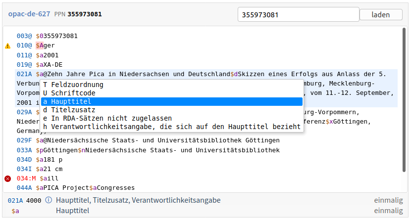

# pica-editor

[PICA+] record display and editor as Vue3 component based on [CodeMirror].

[CodeMirror]:https://codemirror.net/
[PICA+]: https://format.gbv.de/pica/plus

## Usage

Try online at <https://gbv.github.io/pica-editor/>!

## Installation

### Direct use as UMD module in the browser

First include Vue.js 3 and CodeMirror libraries and CodeMirror CSS:

~~~html

<link rel="stylesheet" href="https://unpkg.com/codemirror/lib/codemirror.css">
~~~

Then include the pica-editor library and its CSS file.

~~~html

<link rel="stylesheet" href="https://unpkg.com/pica-editor/dist/pica-editor.css">
~~~

Finally create a Vue application that registers the `PicaEditor` component and make use of the `<pica-editor>` element:

~~~html

  ...
  <pica-editor>
    <pre>003@ $012345</pre>
  </pica-editor>
  ...

~~~

### Use as ES Module in Vue web applications

We recommend to build your application with [vite](https://github.com/vitejs/vite) so Vue modules can be used as single file components (`.vue` files). In you HTML page include CSS files of CodeMirror and PicaEditor:

~~~html
<link rel="stylesheet" href="https://unpkg.com/codemirror/lib/codemirror.css">
<link rel="stylesheet" href="https://unpkg.com/pica-editor/dist/pica-editor.css">

~~~

In a JavaScript module `main.js`:

~~~js
import { createApp } from "vue"
import App from "./App.vue"

const app = createApp(App)
app.mount("#app")
~~~

In your Vue application:

~~~html
<template>
  

    <pica-editor>
      <pre>003@ $012345</pre>
    </pica-editor>
  

</template>

~~~

The sub-component PicaLoader can also be used independently:

~~~js
const { PicaLoader } = PicaEditor.components
~~~

### Configuration

Editor instances can be configured with:

|prop|type|description|
|----|----|-----------|
| unAPI | String | unAPI base URL to load records from |
| dbkey | String | database key to load records from via unAPI |
| ppn | String | record PPN to load |
| xpn | String | optional flag to control record expansion (default: `offline`, alternatively `online`) |
| filter | Function/Boolean | function to filter records when loaded or set |
| editable | Boolean | whether PICA record can be edited |
| avram | Object/URL | Avram Schema with definition of fields and subfields |
| header | Boolean | show/hide header (default `true`) |
| footer | Boolean | show/hide footer (default show only if field info is available) |
| databases | Array | array of databases to select from |

The component emits three events:

* `update:record` when the parsed PICA record has been changed
* `update:dbkey` when the database has been changed

Databases, if given, are expected to be objects of this form:

~~~js
{
  dbkey: "mandatory database key",
  title: { de: "German database name (optional)" }
  picabase: "base URL of catalog to link into (optional)"
}
~~~

To reflect selection change of database and ppn enable two-way binding:

~~~html
<pica-editor :databases="[..]" v-model:dbkey="dbkey" v-model:ppn="ppn" ... />
~~~

The components provides methods:

* `setRecord` to set the PICA record in PICA/JSON structure
* `setText` to set the PICA record in PICA Plain syntax
* `load` to load a PICA record via unAPI (automatically triggered when properties `ppn` and/or `dbkey` are modified)

When `filter` is set to `true`, records are filtered to the current `avram` schema.

For configuration of `PicaLoader` component see [its source code](https://github.com/gbv/pica-editor/blob/dev/src/PicaLoader.vue).

## Development

During development run the sample application in `example/` using vite:

~~~
npm run dev
~~~

To create distribution files in `dist/`:

~~~
npm run build
~~~

The documentation page `docs/index.html` loads local distribution files if opened at `localhost` and published distribution files otherwise.

All commits should be done to the `dev` branch or to feature branches. For releases run `npm run release minor` or `npm run release patch`, this automatically tags and merges into the `release` branch and pushes to GitHub where the release is published at <https://www.npmjs.com/package/pica-editor> and as GitHub release.

## LICENSE

[MIT License](LICENSE)
